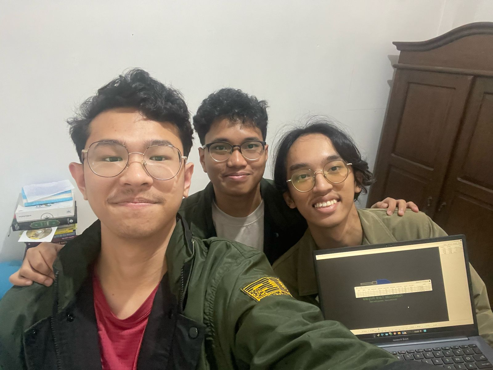

<h1 align="center"> Tugas Besar 1 IF2211 Strategi Algoritma </h1>
<h1 align="center">  Pemanfaatan Algoritma <em> Greedy </em> dalam Pembuatan Bot Permainan <em> Robocode Tank Royale </em> </h1>



## Deskripsi Algoritma Greedy pada Program
1. Greedy by Safe Zone
Greedy by Safe Zone adalah pendekatan greedy dengan memprioritaskan keamanan posisi bot berdasarkan beberapa pertimbangan, seperti jarak dari musuh dan dinding. Algoritma ini mencari posisi optimal di arena yang memberikan keuntungan strategis tertinggi berdasarkan beberapa parameter keamanan tertentu. Konsep “Safe Zone” dalam implementasi ini mencari kemungkinan posisi teraman dengan mempertimbangkan jarak dari dinding, jarak dari musuh, jarak dari pusat arena, dan jarak dari posisi saat ini.

2. Greedy by Fire
Greedy by Fire adalah pendekatan greedy yang memprioritaskan efektivitas serangan bot berdasarkan kedekatan jarak dengan musuh. Algoritma ini mengutamakan musuh yang dalam jangkauan sebagai target utama. Selain itu, apabila ada bot lain yang menembak, bot ini juga akan langsung menghampiri bot yang menembak tersebut. Konsep tersebut dalam implementasi yang dilakukan akan mencari musuh dengan jarak terjangkau untuk diserang terlebih dahulu, mendekatinya, lalu memberikan tembakan dengan kekuatan maksimum dari jarak dekat.

3. Greedy by Avoiding Enemies
Greedy ini menggunakan pendekatan pergerakan terus menerus (dinamis) untuk terus menghindar dari lawan. Algoritma ini akan menentukan pergerakan bot dengan mempertimbangkan jarak dan energi lawan. Bot akan menyerang lawan berdasar jarak dan kecepatan pergerakannya. Bot akan menghindar dan terus mereposisi saat bertemu dengan lawan dan akan bersikap lebih pasif saat berada cukup jauh dari bot lain.

4. Greedy by Ram
Greedy by Ram adalah pendekatan greedy yang memprioritaskan ram sebagai cara melakukan serangan. Algoritma ini mengutamakan musuh yang memiliki energi rendah. Algoritma ini akan mendeteksi musuh dengan cara scanning dan ketika di-hit oleh peluru musuh. Konsep tersebut dalam implementasi dilakukan dengan mencari musuh dengan energi rendah terlebih dahulu, lalu menabrak dengan kecepatan penuh.

## Project Structure
```bash
.
├───README.md
│
src/
├── main-bot/
│   └── GreedyByFire/
│       ├── BigBoss.cs
│       ├── BigBoss.json
│       ├── BigBoss.csproj
│       ├── BigBoss.cmd
│       └── BigBoss.sh
├── alternative-bots/
│   ├── GreedyBySafeZone/
│   │   ├── FirstBot.cs
│   │   ├── FirstBot.json
│   │   ├── FirstBot.csproj
│   │   ├── FirstBot.cmd
│   │   └── FirstBot.sh
│   ├── GreedyByAvoidingEnemies/
│   │   ├── botRobot.cs
│   │   ├── botRobot.json
│   │   ├── botRobot.csproj
│   │   ├── botRobot.cmd
│   │   └── botRobot.sh
│   └── GreedyByRam/
│       ├── LittleBoss.cs
│       ├── LittleBoss.json
│       ├── LittleBoss.csproj
│       ├── LittleBoss.cmd
│       └── LittleBoss.sh
doc/
├── bebasaja.pdf
```


## Requirements Program
1. **Jar Game Engine** dan **Bot Starter Pack**
    Requirement yang harus di-install berada pada link berikut: 
    (https://github.com/Ariel-HS/tubes1-if2211-starter-pack/releases/tag/v1.0)
2. Source code bot pada repository ini(download folder BigBoss)


## Command Build Program
1. Run game engine dengan mengetikkan command di bawah:
    ```bash
    java -jar .\robocode-tankroyale-gui-0.30.0.jar
    ```
2. Lakukan config bot root directories, pilih direktori dimana anda menaruh folder program bot
3. Pilih menu start battle dengan terlebih dahulu melakukan boot pada bot yang akan bertanding
4. Klik tombol start battle dan bersiaplah menjadi pemenang!

## Authors
### **Kelompok "Bebas aja"**
|   NIM    |                  Nama                  |
| :------: | :-------------------------------------:|
| 13523005 |            Muhammad Alfansya           |
| 13523068 |        Muhammad Rusmin Nurwadin        |
| 13523114 |             Guntara Hambali            |

## Link Youtube Presentasi
https://youtu.be/NjCDjsYdjYo